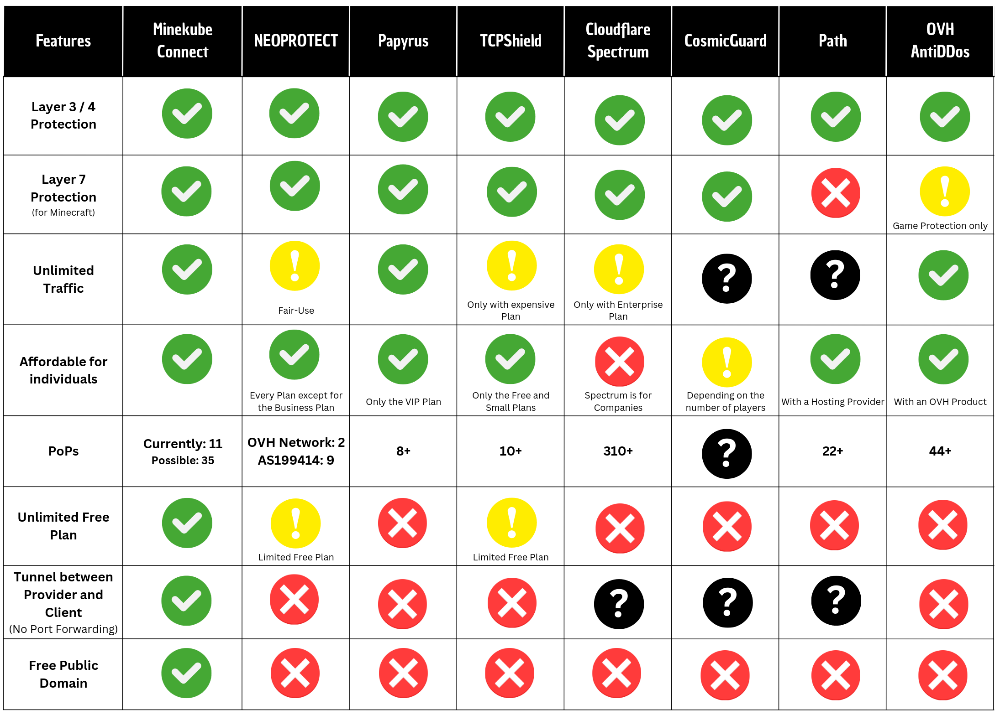

Compared to classic Gate, Velocity or BungeeCord - Gate Lite, a mode of the [Minekube Gate proxy](https://gate.minekube.com/), acts as a lightweight reverse proxy for Minecraft Java. Unlike Gate, Velocity, or Bungeecord, it doesn't offer features like combining multiple Minecraft servers to a network or implementing network-wide features. Gate Lite sits in front of these proxies and simply forwards incoming connections to them. In addition, it offers features like an offline MOTD, several security enhancements, and the ability to handle multiple Minecraft networks behind one port.

## Introduction

Gate is an excellent alternative to Velocity, and the Connect network is actually based on it. Trust us, you won't regret it! You'll love the benefits of using Gate and Gate Lite, as it can help protect your server or network.

#### And how does the routing work?

Gate Lite detects the hostname you join with and uses it to determine the appropriate route. This allows you to use multiple domains for different backends while only requiring one port.

Gate Lite searches the list of routes from top to bottom. It also supports wildcards with `*` (which matches any number of characters) and `?` (which matches any single character). Multiple hostnames per backend are also allowed with `[ "abc.example.com", "def.example.com" ]`.

Gate Lite ensures that the configured backend is online before forwarding the connection. This approach guarantees that the user's request is always directed to an available backend. In case multiple backends are configured for the route, Gate Lite randomly selects one and checks if it is online. If the selected backend is offline, Gate Lite repeats this process until an online backend is found or every backend has been tested.

**Example of Gate Lite Routing:**


The configuration for this might look something like this:
```yaml
config:
  lite:
    enabled: true
    routes:
      - host: abc.example.com
        backend: 10.0.0.3:25568
      - host: '*.example.com'
        backend: 10.0.0.1:25567
      - host: [ example.com, localhost ]
        backend: [ 10.0.0.2:25566 ]
```

#### Technical explanation

When Minecraft Java sends its [handshake packet](https://wiki.vg/Protocol#Handshaking), it includes the server address, protocol version, and port. Gate Lite is able to decode this packet and extract the server address field, which it then uses to locate the corresponding route in the configuration. This process is made simple and efficient thanks to Gate Lite's architecture.

Gate Lite's unique approach is that it ensures that the connection speaks the Minecraft protocol before forwarding it. This adds an extra layer of security, as it prevents malicious traffic from reaching the backend server.

In addition, Gate Lite is significantly faster than other proxies when piping the connection through. This is because it operates on the application layer of the network, and it only forwards connections that adhere to the Minecraft protocol. This results in a more efficient and streamlined process for the users. Gate Lite reduces the number of TCP connections required for ping requests by caching the motd and server icon. By caching the motd and server icon, only one TCP connection to the backend is needed every X minutes to provide the motd for thousands of ping requests. This approach optimizes the performance of the backend by reducing the load on it.

As I mentioned earlier, this technique can help prevent [layer 7](https://en.wikipedia.org/wiki/OSI_model) flooding attacks, such as motd-spam.

[Learn more about Gate Lite](https://gate.minekube.com/guide/lite.html)

## How Gate Lite protects you from unknown hostnames

**To achieve this, it is crucial to avoid having a route with `*` in your configuration.**

Rest assured that Gate Lite prevents connections from unconfigured hostnames or domains, and only allows connections if a suitable route is found in the configuration. Gate Lite ensures that only connections from explicitly allowed hostnames and domains are allowed, protecting you from offensive ones. Don't give the competition a chance to make you look bad with strange domains 😉.

## What can Gate Lite do against DoS and DDoS attacks?

Gate Lite can do several things to reduce the impact of an attack. In addition to the extremely low resource usage, which I will discuss later, Gate Lite offers the following features:

### Rate Limits

Gate provides two rate limits, a connection rate limit and a login rate limit.

**Connection limit:** The connection limit is triggered for every new connection, regardless of whether a route is found. When the rate limit is reached, the `/24 subnet` of the IP is blocked for a short time.
The login limit is the same as the connection limit, but it is placed just before the player authenticates to Mojang to prevent flooding the Mojang API.

**In Lite mode, only the Connection limit works since authentication is handled by the backend.**

### Caching

Gate Lite caches the MOTD and server icon of the backends for a configured time. When you request a MOTD, Gate Lite will respond from its cache, which reduces the load on the backend. This feature helps prevent attacks that aim to make your server unavailable through mass MOTD requests.

**Technical explanation:**
This results in a more efficient and streamlined process for the users. Gate Lite reduces the number of TCP connections required for ping requests by caching the motd and server icon. By caching the motd and server icon, only one TCP connection to the backend is needed every X minutes to provide the motd for thousands of ping requests. This approach optimizes the performance of the backend by reducing the load on it.
As I mentioned earlier, this technique can help prevent [layer 7](https://en.wikipedia.org/wiki/OSI_model) flooding attacks, such as motd-spam.

### Limited Layer 3 and 4 protection

Gate Lite operates on the [application layer](https://en.wikipedia.org/wiki/OSI_model) of the network, providing protection for the backend server against attacks on the [network and transport layers](https://en.wikipedia.org/wiki/OSI_model). Gate Lite operates on the application layer of the network, providing protection for the backend server against attacks on the network and transport layers. This ensures that your server is secure.

Attacks against Minecraft servers and networks are most commonly aimed at layers 3 and 4, as they are relatively simple to execute and can be used against almost any other internet service. These attacks aim to consume the server's bandwidth. However, if the server running Gate Lite has sufficient bandwidth and a functional layer 3 and 4 DDoS protection, it becomes challenging to attack the backend server. More information will be provided later.

**To ensure security, we recommend that access to the backend server be limited to Gate Lite only.**

**Technical explanation:**
Gate Lite operates on [layer 7 of the OSI model](https://en.wikipedia.org/wiki/OSI_model) and routes connections based on the hostname or domain in the [handshake packet](https://wiki.vg/Protocol#Handshaking). If the incoming connection is only on layer 4 and the handshake packet doesn't exist, Gate Lite will drop the connection because it doesn't follow the Minecraft protocol. This ensures that only valid connections reach the backend, improving security and efficiency.

As I mentioned earlier, the most common attacks are aimed at layers 3 and 4, with the goal of overwhelming the victim's bandwidth. However, if the server running Gate Lite has functional layer 3 and 4 attack protection, it can reduce incoming bandwidth and prevent it from filling up the server's available bandwidth. This means that your backend servers will be well protected against such attacks, even if they lack adequate protection. Gate Lite is an excellent choice for servers with limited resources. You can rest assured that it will perform effectively, even on less powerful servers. We will provide more information on this later.

#### DDoS protection services

To effectively prevent network capacity attacks on your server, it is essential to have a reliable DDoS protection service. Fortunately, there are many providers to choose from. In this section, we will provide a brief comparison of some well-known providers, including Minekube Connect.

Please keep in mind that this is a basic comparison and for more technical details, we recommend visiting the provider's websites.



## How powerful are Gate and Gate Lite?

Gate is written in Go, a modern programming language designed for cloud development. It requires only a few megabytes of RAM and some CPU resources to run. Gate Lite requires even fewer resources because it only pipes bytes.

**Technical explanation:**
Gate is a great choice for those who want to optimize their resource usage. Thanks to its Go-based architecture, Go compiles programs into executable files, similar to C or Rust, which can be run directly. This means that Gate uses fewer resources than Java, which compiles its programs to run on the [Java Virtual Machine (JVM)](https://en.wikipedia.org/wiki/Java_virtual_machine). While the JVM makes it easier to develop software that can run on any machine that supports it, it also requires more resources. By choosing Gate, you can ensure that your software runs efficiently without sacrificing functionality.

### Efficiency during an attack

Minekube's Connect Network is based on a modified version of Gate. During a layer 7 bot attack against one of the endpoints, the memory and CPU usage wasn't much higher than normal:


### Efficiency compared to other Minecraft proxies

Compared to other proxies such as Velocity, which are already well optimized, Gate uses fewer resources even with many players. This not only reduces server costs but also improves the user experience by eliminating lag during scaling.


### Gate and Gate Lite works almost anywhere

Gate and Gate Lite can run on a wide range of systems due to their low resource usage. They are available as an executable file, Docker image, and Kubernetes-ready, making them suitable for small VPS instances as well as large servers that support thousands of players.

[Learn more about running Gate](https://gate.minekube.com/guide/quick-start.html)

## How to get the benefits of Gate Lite without having to worry about it

If you're not interested in hosting Gate Lite yourself or lack experience, don't worry! You can use Minekube Connect instead. Connect offers all the benefits of Gate Lite, plus DDoS protection, and it's completely free. Integrating Connect into your existing server/network is straightforward and easy.

### But what is Connect?

Connect is a global edge network behind which anyone can connect their Minecraft server or network for free. Every server gets its own anycast domain. Connect uses tunnels to connect players to each server. There is no need for port forwarding.

**Check out [Minekube Connect](https://connect.minekube.com/) today and get all the advantages!**

---

**If you have any further questions about Gate, Gate Lite or Connect, feel free to join the [Minekube Discord](https://minekube.com/discord)!**