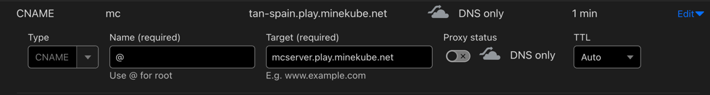
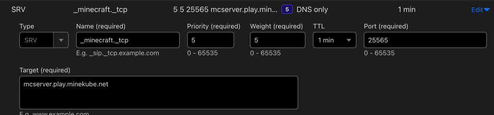

# Use a custom domain <VPBadge>Always Free</VPBadge>

When you create a Connect Endpoint, it is automatically given a `play.minekube.net` sub-domain, based on the endpoint’s
name. This is great for testing and private servers, but when you want to go to full production you’ll want your
endpoint to appear on your own domain.
That’s where the Connect custom domains comes in.
Let’s set up the custom domain, first step: directing traffic to your
endpoint.

## Set a CNAME record <VPBadge>Option 1</VPBadge>

The simplest option for directing traffic to your endpoint is to create a CNAME record for your custom domain that
points at your `<endpoint>.play.minekube.net` host. For example, if you have a custom domain called `example.com` and an
endpoint called `mcserver`, then you can create a CNAME record for `example.com`‘s DNS that would look like:

If you want to make a subdomain like `mc`, set the `Name` to: `mc`

You’ll need to configure this with your DNS provider. The example screenshot uses Cloudflare.

Now, accessing `example.com` will tell the DNS system to look up `mcserver.play.minekube.net` and return its results.

## Or, set an SRV record <VPBadge>Option 2</VPBadge>

If you want to use an SRV record instead of a CNAME, you can do that too. Use an SRV record if
you can’t use a CNAME record at the root of your domain anymore, because you have other records there (a website, for
example).

An SRV record for `example.com` would look like:

If you want to make a subdomain like `mc`, append it like so in the `Name` field: `_minecraft._tcp.mc`

## Add your domain <VPBadge>Do not forget!</VPBadge>

You'll need to go to the [Connect Dashboard](https://app.minekube.com) and add your domain to your endpoint.

1. Go to the endpoint you want to add a domain to
2. Click on `Custom Domains`
3. Click on `Add Domain`
4. Enter your domain

### Domain verification

Your domain will be verified automatically when it detects the CNAME or SRV record set up previously.
When you are done, you will be able to join your connected endpoint with your domain, within a few seconds.
