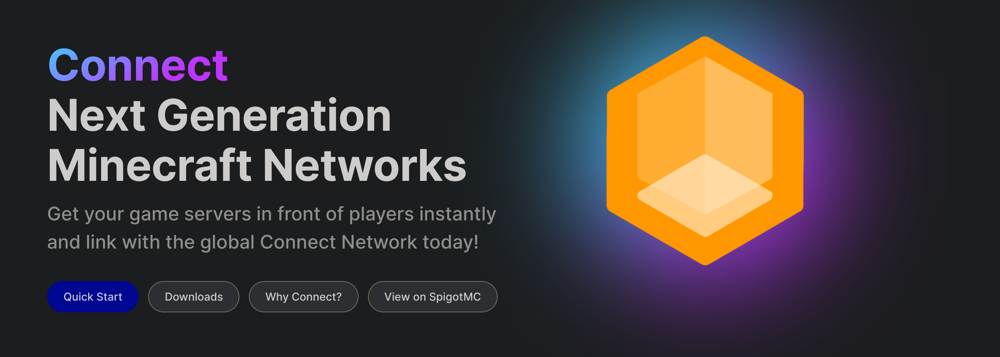

[](https://connect.minekube.com)

# Minekube Connect

[](https://github.com/minekube/connect/releases)
[](https://pkg.go.dev/go.minekube.com/connect)
[](https://golang.org/doc/devel/release.html)
[](https://goreportcard.com/report/go.minekube.com/connect)
[](https://github.com/minekube/connect/actions?query=workflow%3Atest)
[](https://discord.gg/6vMDqWE)

**Connect** allows you to connect any Minecraft server,
whether it's in online mode, public, behind your protected home network or anywhere else in the world,
with our highly available, performant and low latency edge proxies network nearest to you.

**Browse active servers now! Join `minekube.net` with your Minecraft client!**

> Note that the [client is open source](https://github.com/minekube/connect-java), but not the server side production service.

## Bedrock support

Connect now lets Bedrock players join connected servers through the same endpoint names,
`play.minekube.net` subdomains, and custom domains Java players already use. If you use
the Connect plugin on Paper/Spigot, Velocity, or BungeeCord, there is no Geyser plugin
or extra Bedrock proxy to install.

If you self-host standard Gate and want Bedrock players to connect directly to that Gate
instance, enable Gate-managed Bedrock with one config line:

```yaml
bedrock: true
```

You do not need this setting just to receive Bedrock players through the Connect network.

For proxy, TCPShield, direct-backend, and login-plugin setups, see the
[forwarding and topology guide](https://connect.minekube.com/guide/topologies) and
[compatibility matrix](https://connect.minekube.com/guide/compatibility).

## Features

- [x] ProtoBuf typed
- [x] Streaming transport protocols
  - [x] WebSocket support
    - equally or more efficient than gRPC
    - better web proxy support: cloudflared, nginx, ...
  - [ ] gRPC support (improved developer experience)
    - No immediate support planned, [see](internal/grpc)
- [x] Minekube Connect plugin support for:
  - [x] [Gate](https://github.com/minekube/gate)
  - [x] [Spigot/PaperMC](https://github.com/minekube/connect-java)
  - [x] [Velocity](https://github.com/minekube/connect-java)
  - [x] [BungeeCord](https://github.com/minekube/connect-java)
  - [ ] Sponge
  - [ ] Minestom
- [x] Client side service tooling in Go
- [x] Server side service tooling in Go
- [x] Client- & service-side tests implementation in Go
- [x] Awesome [documentation website](https://connect.minekube.com/)
